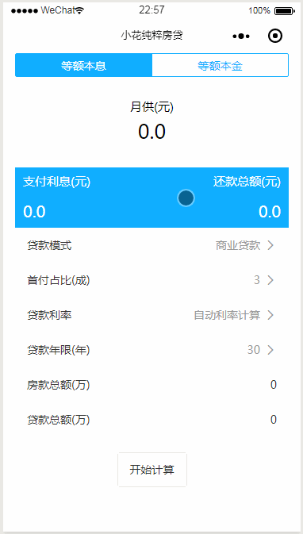

## 项目介绍
分别用mpvue框架、uni-app框架、原生微信小程序写的三个微信小程序的实例代码。

不同项目下分别有个README.md介绍本项目的相关说明，如有疑问请及时反馈。
### min-bilibili
使用微信小程序原生开发完成的实例，仿bilibili的两个web app页面。
### min-uni-app
使用uni-app结合vue开发的微信小程序实例展示，经典的todo-list。
### min-vant-mpvue
使用mpvue框架，结合vue及饿了么组件库vant做的房贷计算小程序，现已发布，欢迎体验。

## 效果展示
### min-bilibili

### min-uni-app

### min-mpvue

## 相关链接
[我与小程序二三事]()

